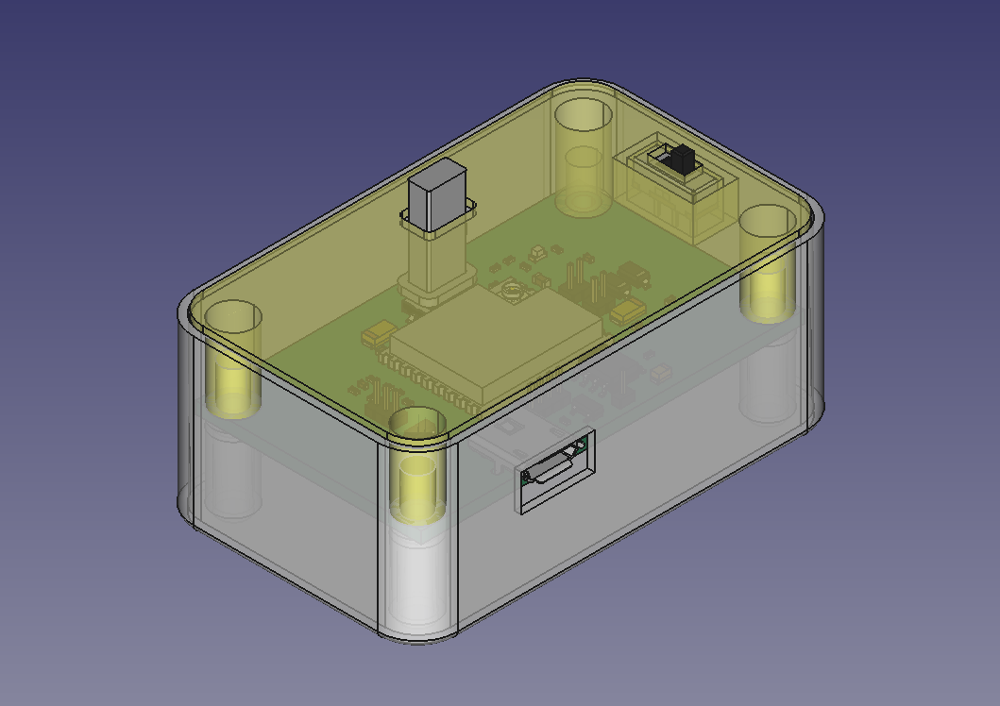

# Mains Monitor

The device monitors a presence of mains voltage and sends notifications to the Backend when it turns on or off.
It uses ESP32-C3 MCU as a core component. It implements the logic of the device and connects it to the outer world via Wi-Fi.

The device powers from 5V DC via micro-USB connector and from 3.7V 1000 mAh Li-Po battery, when mains is not available.
Most of the time the device stays in deep sleep mode, so it consumes micro Amps. It wakes up for 20 sec when 5V DC power source becomes available or turns off just for sending a notification to the Backend, then goes to deep sleep again. Peak power consumption when device is transmitting data via Wi-Fi is 500 mA.

# First launch configuration

When device starts the first time it creates a Wi-Fi hotspot network with SSID ``MD_<CHIPID>``. The password is ``md123456``.
Connect to it from a smartphone. After that it will open a configuration portal powered by WiFiManager Arduino library. It allows you to select a home Wi-Fi network the device will be connected to and a DTEK group number. The DTEK group number will be used later on the Backend.

# Folders & files description

* ``cad/`` - FreeCAD project and *.STL files of the enclosure for 3D printing
* ``libs/`` - KiCAD library files (schematic symbols and footprints)
* ``production/`` - Gerber, component placement files and Bill Of Materials for PCB production on the factory (for example, JLCPCB)
* ``firmware/`` - firmware sources for ESP32-C3 MCU, the heart of Mains Monitor

# Schematic

## PCB design

See [PDF file](doc/pcb-design.pdf) or ``./mains-detector.kicad_pcb`` filer in KiCAD format.